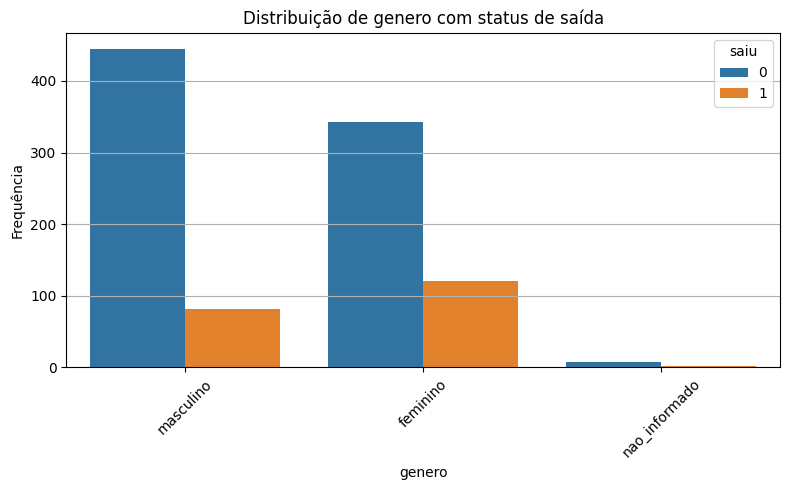
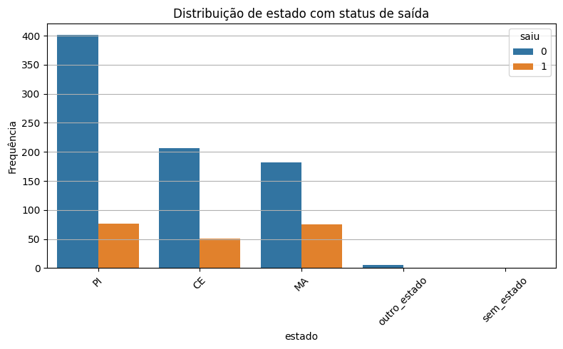
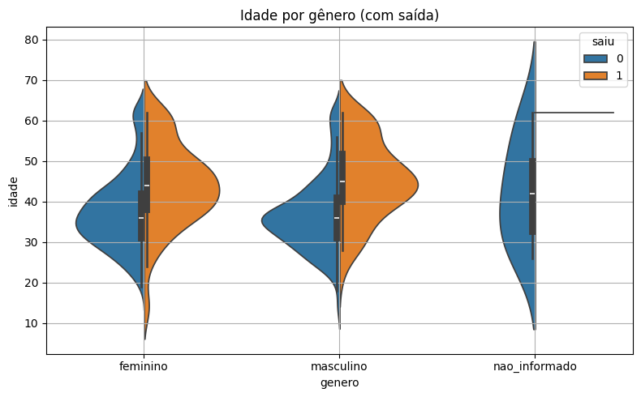
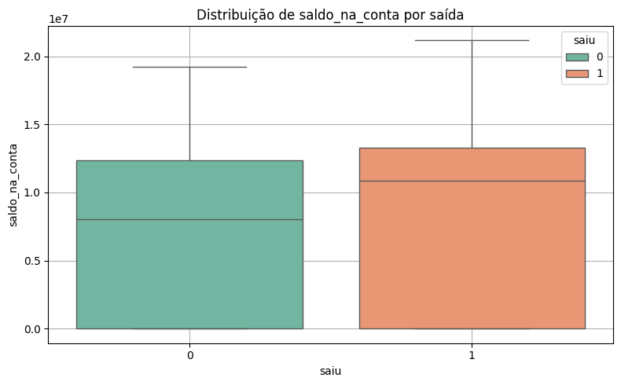
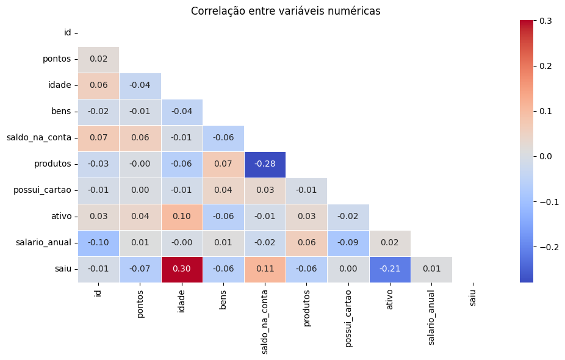

# 📄 Relatório Final — Desafio 4

**Desafio:** Trilhas 2B — Inova Maranhão  
**Autor:** Francisco Matheus Vaz dos Santos  
**Entrega:** 20/05/2025  

## 1. Introdução

Este projeto teve como objetivo aplicar técnicas de limpeza, análise e exploração de dados sobre uma base de clientes de um banco com atuação regional no Nordeste brasileiro. A base apresentava inconsistências comuns em dados brutos: valores nulos, categorias inconsistentes, outliers e erros de digitação. 

A análise foi conduzida para limpar os dados, entender padrões de evasão (clientes que saíram do banco) e identificar insights que auxiliem na tomada de decisão estratégica.  
Os resultados buscam apoiar decisões da área que trabalha a retenção de clientes.

## 2. Metodologia

O pipeline foi dividido em etapas modulares, utilizando **Python** e bibliotecas como **Pandas**, **Seaborn** e **Matplotlib**:

- Carregamento e renomeação das colunas no formato padronizado para machine learning.
- Tratamento de dados ausentes, outliers e duplicados.
- Correção de categorias inválidas: `gênero` e `estado`.
- Exploração categórica: distribuições por estado, gênero e status de saída.
- Exploração numérica: histogramas, boxplots e correlação.
- Estatísticas descritivas e identificação de perfis de churn.

## 3. Resultados Visuais e Exploratórios

### 3.1 Gênero e Evasão

A análise demonstrou que clientes do **gênero feminino** têm uma **proporção de saída maior** em relação ao total da sua categoria, mesmo sendo minoria na base.

### 3.2 Estado e Evasão

Apesar de o estado **PI** ter o maior número de clientes, o **MA** apresenta a **maior taxa proporcional de saída**. CE também possui representação significativa.  
Outros estados foram agrupados como `outro_estado` e valores inválidos foram tratados como `sem_estado`.

### 3.3 Faixa Etária

A faixa etária de clientes varia entre 18 e 70 anos.  
A idade mediana dos clientes que saíram está ao redor dos **45 anos**, indicando concentração em clientes de meia-idade.

### 3.4 Saldo e Bens

- O **saldo médio dos clientes que saíram** foi **ligeiramente superior** ao dos que permaneceram.
- O número de **bens** também está bem distribuído entre os dois grupos.

Apesar de apresentarem saldo elevado, esses clientes optaram por sair, o que reforça a hipótese de que a decisão de evasão não é guiada apenas por aspectos financeiros.

### 3.5 Correlação

A matriz de correlação revelou **baixas correlações entre as variáveis numéricas e o churn**.  
A maior foi entre **idade** e **saiu** (~0.30), sugerindo que outras variáveis qualitativas podem ser relevantes.

A ausência de correlações fortes reforça a necessidade de investigar variáveis comportamentais ou contextuais.

## 4. Estatísticas Descritivas

### 4.1 Saldo por Faixa Etária

- **Menores de 40 anos:**  
  - Média ≈ R$ 7.000.000  
  - Mediana ≈ R$ 8.200.000

- **Maiores ou iguais a 40 anos:**  
  - Média ≈ R$ 7.300.000  
  - Mediana ≈ R$ 9.700.000

### 4.2 Saldo por Status de Saída

- **Clientes que saíram:**  
  - Média ≈ R$ 8.500.000  
  - Mediana ≈ R$ 10.800.000

- **Clientes que ficaram:**  
  - Média ≈ R$ 6.800.000  
  - Mediana ≈ R$ 8.000.000

### 4.3 Perfis de Churn

Abaixo, listamos os três segmentos mais representativos entre os clientes que saíram:

| Gênero    | Estado | Idade Mediana | Saldo Médio  | Bens Médios | Qtd |
|-----------|--------|----------------|---------------|--------------|------|
| Feminino  | PI     | 46             | R$ 6.900.000  | 4.5          | 50   |
| Feminino  | MA     | 41             | R$ 11.600.000 | 5.3          | 39   |
| Masculino | MA     | 44             | R$ 11.300.000 | 5.2          | 36   |

## 5. Conclusão

A análise revelou:

- Maior **proporção de saída entre clientes do gênero feminino**, especialmente nos estados de **PI** e **MA**.
- A **idade mediana dos clientes que saíram** está em torno de 45 anos.
- O **saldo dos clientes que saem é relativamente alto**, o que indica que fatores não financeiros podem estar por trás da evasão.
- **Nenhuma variável numérica isolada tem correlação forte com o churn.**

## ✅ Próximos passos recomendados

### 🔍 Análise qualitativa ou survey:
Entrevistar ex-clientes ou aplicar uma pesquisa de satisfação pode revelar motivos de saída não evidenciados nos dados estruturados.

### 🤖 Modelagem preditiva de churn:
Com os dados limpos e insights obtidos, o próximo passo natural seria treinar modelos de machine learning para prever a evasão de clientes com base em perfis semelhantes.

### 🎯 Ações de retenção direcionadas:
Criar campanhas específicas para os grupos de maior risco (por exemplo, mulheres com faixa etária média e saldo elevado, residentes em PI e MA).